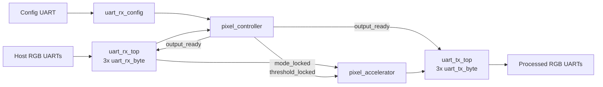
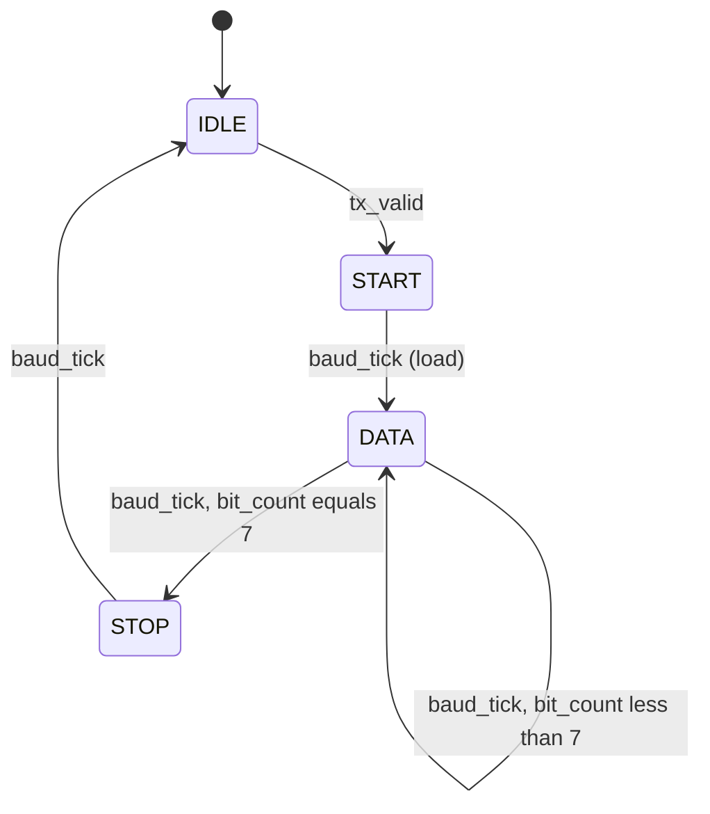
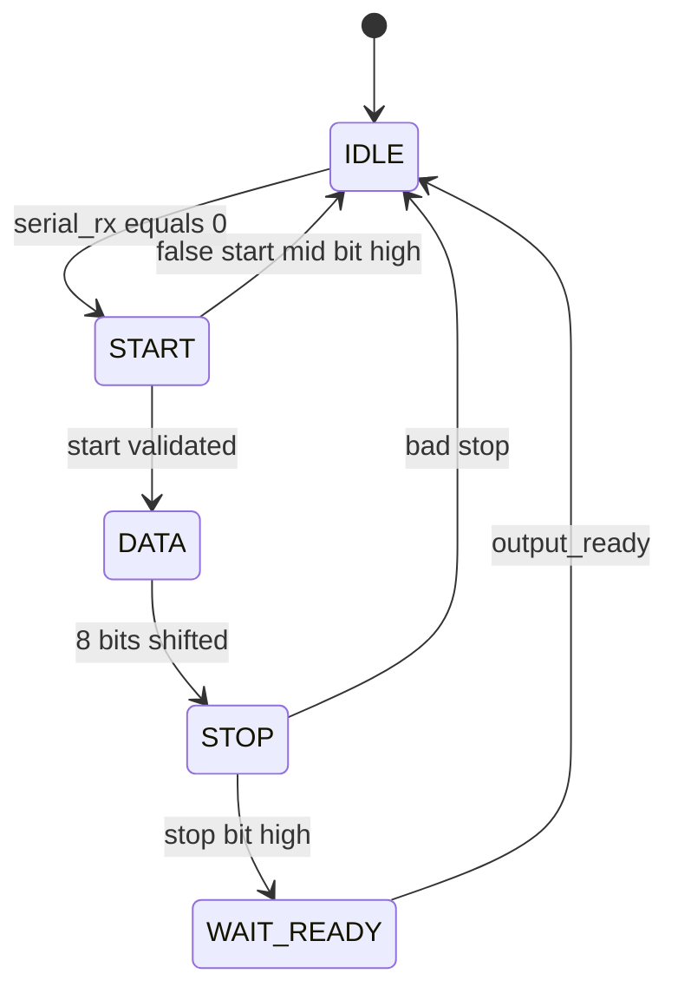

# SoCET2img Interview Study Guide

Use this document to learn the project deeply for interviews. The goal is not memorization: be able to **draw**, **trace**, **calculate**, **defend tradeoffs**, and **propose improvements**.

---

## Part 1 — Architecture Story

### 60-second pitch (memorize)

> This is a streaming **80×60 RGB** image-transform accelerator. Three parallel UART receivers collect R, G, and B bytes; a fourth UART receives configuration (mode, then threshold). A controller waits until all three color bytes are ready, a **combinational** pixel accelerator transforms the pixel, and three parallel UART transmitters send the result. The implemented system is UART-based; **VGA is still future scope**.

### 30-second version

> Streaming UART RGB image processor: config UART sets mode/threshold, three RX wires bring a pixel, a combinational accelerator transforms it, three TX wires send it out. No framebuffer — one pixel at a time.

### 2-minute version

1. Host sends mode byte, then threshold byte on `rx_config`.
2. Controller locks those values and enters `STREAM`.
3. Host streams 4,800 pixels (80×60) as parallel R/G/B UART frames.
4. Each RX channel holds its byte in `WAIT_READY` until all three are ready.
5. `output_ready` acknowledges RX and launches TX with accelerator outputs.
6. After the frame, controller returns to accepting a new mode.

### End-to-end architecture



### Top-level I/O ([top.sv](top.sv))

| Port | Direction | Meaning |
|------|-----------|---------|
| `clk`, `n_rst` | in | System clock, active-low async reset |
| `rx_r/g/b` | in | Parallel RGB UART RX |
| `rx_config` | in | Mode/threshold UART RX |
| `tx_r/g/b` | out | Parallel RGB UART TX |

### Active file list ([top_files.f](top_files.f))

- Integration: `top.sv`, `pixel_controller.sv`
- Datapath: `jihee_hw_accelerator/pixel_accelerator.sv`
- UART RX: baud, sync, shift, FSM, byte, config, top
- UART TX: shift, FSM, byte, top
- TB: `top_tb.sv` (currently only exercises controller — see limitations)

### Redraw checklist (from memory)

- [ ] Four RX pins + three TX pins
- [ ] Config path separate from RGB path
- [ ] Controller locks mode/threshold, drives `output_ready`
- [ ] Accelerator is combinational (no clk)
- [ ] Same `output_ready` acks RX and triggers TX
- [ ] `tx_ready` left unconnected at top

---

## Part 2 — Subsystem Mastery

For every module, answer: **inputs/outputs**, **state/storage**, **combinational behavior**, **timing/latency**, **failure behavior**.

### 2.1 Baud generator ([baud_generator.sv](UART_RTL/uart/baud_generator.sv))

| Topic | Answer |
|-------|--------|
| I/O | `clk`, `n_rst`, `sync_reset` → `baud_tick` |
| Storage | `baud_counter` |
| Behavior | Pulse `baud_tick` for 1 cycle every `CLKS_PER_BIT` clocks |
| Timing | `CLKS_PER_BIT = CLOCK_FREQ / BAUD_RATE` (integer divide) |
| Failure | Wrong freq/baud params → timing skew / framing errors |

`sync_reset` realigns the counter (RX start-bit, TX launch).

### 2.2 UART TX path

**Hierarchy:** `uart_tx_top` → 3× `uart_tx_byte` → (`uart_tx_fsm` + `uart_tx_shift_reg`) + shared `baud_generator`.

**TX FSM states:** `IDLE → START → DATA → STOP → IDLE`



**Trace one byte (e.g. `0xA5 = 1010_0101`, LSB first):**

1. `output_ready & tx_ready` → `tx_valid` in `uart_tx_byte`.
2. IDLE: `tx_ready=1`, on valid → START, assert `baud_resync`.
3. START: drive serial low; on `baud_tick` → DATA, assert `load`.
4. DATA: `serial_tx = shift_out[0]`; each `baud_tick` shifts right; 8 bits.
5. STOP: drive serial high for one baud period → IDLE.

**Key signals**

- `tx_ready` (per channel): high only in IDLE.
- Aggregate `tx_ready` in top: AND of R/G/B.
- Only R channel’s `baud_resync` connects to the shared baud generator.

**Latency:** ~10 baud periods per byte (start + 8 data + stop).

### 2.3 UART RX path

**Hierarchy:** `uart_rx_top` → 3× `uart_rx_byte` → (`uart_rx_sync` + local/shared baud + `uart_rx_fsm` + `uart_rx_shift_reg`).

**RX FSM states:** `IDLE → START → DATA → STOP → WAIT_READY → IDLE`



**Synchronizer ([uart_rx_sync.sv](UART_RTL/uart/uart_rx_sync.sv))**

- Two flip-flops on async `serial_rx`.
- Resets to idle-high (`1`).
- Bypassed only when `USE_SHARED_BAUD=1` (same-clock loopback).

**WAIT_READY / `*_ready`**

- After valid stop, FSM holds `px_ready=1` and keeps the byte.
- Downstream must pulse `output_ready` to return to IDLE.
- Pixel is valid when `r_ready && g_ready && b_ready` (may rise on different cycles).

**False start:** mid-START, if line is high at half-bit → back to IDLE.

**Framing error:** bad STOP (line low) → IDLE, no `px_ready`.

### 2.4 Config RX ([uart_rx_config.sv](UART_RTL/uart/uart_rx_config.sv))

- Thin wrapper around `uart_rx_byte` with local baud.
- In `top.sv`, `config_ack` is tied to `config_ready` (self-ack).

### 2.5 Pixel controller ([pixel_controller.sv](pixel_controller.sv))

**States:** `INPUT_MODE → INPUT_THRESHOLD → STREAM → (rollover) → INPUT_MODE`

| State | Behavior |
|-------|----------|
| `INPUT_MODE` | On `config_ready`, latch `config_byte[2:0]` → `mode_locked`; go to threshold |
| `INPUT_THRESHOLD` | On `config_ready`, latch `config_byte[4:0]` → `threshold_locked`; go to STREAM |
| `STREAM` | `output_ready = r_ready & g_ready & b_ready`; count pixels; on rollover → INPUT_MODE |

**Storage:** `state`, `mode_locked`, `threshold_locked`, `pixelCount` (13-bit), `rollover`.

**Handshake meaning of `output_ready`:** “complete RGB pixel present — consume RX and launch TX.”

### 2.6 Pixel accelerator ([pixel_accelerator.sv](jihee_hw_accelerator/pixel_accelerator.sv))

| Mode | Code | Behavior |
|------|------|----------|
| Passthrough | `000` | `out = in` |
| Invert | `001` | `255 - in` |
| Brighten | `010` | `in + thr`, saturate at 255 |
| Darken | `011` | `in - thr`, floor at 0 |
| Grayscale | `100` | shift approx → R=G=B |
| Default | else | passthrough |

- **No clock** — pure combinational.
- Brighten/darken use **9-bit** intermediates for overflow/underflow.
- Grayscale (shift approximation):
  - `R>>2 + R>>4` ≈ 0.3125 R
  - `G>>1 + G>>4` ≈ 0.5625 G
  - `B>>4` ≈ 0.0625 B
  - Sum ≈ 0.9375 (not 1.0) → slightly dark vs ideal luminance.

### 2.7 One-pixel clock-by-clock story (STREAM)

1. Host drives three UART frames (possibly staggered).
2. Each RX finishes → its `*_ready` high, byte on `*_in`.
3. When all three ready: `output_ready=1`.
4. Combinational accelerator produces `r/g/b_out` from locked mode/threshold.
5. Same cycle (combinational path): TX sees `output_ready & tx_ready` → starts START bit.
6. RX FSMs see `output_ready` → leave WAIT_READY → IDLE (ready for next byte).
7. TX shifts 10 bits per channel; when done, `tx_ready` high again.

---

## Part 3 — Numbers and Verification Map

### Must-know calculations

**UART framing (8N1)**  
10 serial bits per byte: 1 start + 8 data + 1 stop.

**Throughput (nominal 115200 baud, 3 parallel channels)**

\[
\frac{115200}{10} = 11520 \text{ bytes/s per channel} = 11520 \text{ pixels/s}
\]

\[
\frac{11520}{4800} \approx 2.4 \text{ frames/s}
\]

(ignoring gaps, config overhead, and TX busy stalls)

**Baud divider @ 66 MHz**

\[
\text{CLKS\_PER\_BIT} = \lfloor 66000000 / 115200 \rfloor = 572
\]

\[
\text{effective baud} = 66000000 / 572 \approx 115384.6
\]

\[
\text{error} \approx +0.16\% \quad (\text{acceptable for UART})
\]

**Sim clocks** (testbenches use 1 MHz): `CLKS_PER_BIT = 8` → effective 125 kbaud; DUT and TB share the same truncated value, so mismatch is **not** tested.

**Saturation example**

- Brighten `240 + 20` → 9-bit `260` → clamp `255`.
- Darken `10 - 20` → 9-bit MSB set → clamp `0`.

**Grayscale example** (`R=100, G=150, B=200`)

- R: `25 + 6 = 31`
- G: `75 + 9 = 84`
- B: `12`
- Sum ≈ `127` (ideal ~0.299/0.587/0.114 weights ≈ 141)

### Verification → requirement map

| Test | File | Proves | Does **not** prove |
|------|------|--------|---------------------|
| TX bit decode | `UART_RTL/tb/tb_uart_tx.sv` | START/data/STOP, LSB-first, 2 pixels, `$fatal` | Async host, baud mismatch |
| RX suite | `UART_RTL/tb/tb_uart_rx.sv` | False start, bad STOP, parallel + staggered RGB, multi-frame | Shared-baud path, top integration |
| Loopback | `UART_RTL/tb/tb_uart_loopback.sv` | TX→RX shared-baud end-to-end, 3 pixels | Synchronizer, independent baud drift |
| Accelerator | `jihee_hw_accelerator/tb_pixel_accelerator.sv` | Mode smoke tests (prints) | Numeric gray accuracy, `$fatal` |
| Controller | `pixel_controller_tb.sv` | Config + stream sequencing | Full UART, TX backpressure |
| `top_tb.sv` | `top_tb.sv` | Name suggests top | **Does not instantiate `top`** |

**Why self-checking > GTKWave-only**

- Waveform review is manual and easy to miss.
- `$error` + `$fatal` + timeouts fail CI/`make` automatically.
- Concurrent decode (TX TB) checks the **serial protocol**, not just “something toggled.”

**Run regression (WSL):**

```bash
cd UART_RTL/tb && make all
```

---

## Part 4 — Limitations (symptom → root cause → fix)

Be candid. Interviewers prefer ownership over perfection.

### 1. Pixel loss when TX busy (HIGH)

- **Symptom:** RX can be acknowledged while TX ignores the request → dropped pixel.
- **Root cause:** `top.sv` ties RX ack and TX launch to the same `output_ready`, and leaves `tx_ready` unconnected (`tx_ready()`).
- **Fix:** Proper valid/ready: only ack RX when `tx_ready`; or insert a 1-pixel register/FIFO between accelerator and TX.

### 2. Frame counter off-by-one / not handshake-qualified (HIGH)

- **Symptom:** Rollover when `pixelCount == 4799` even if `output_ready` is low that cycle.
- **Root cause:** Rollover check is outside the `else if (output_ready)` path in `pixel_controller.sv`.
- **Fix:**

```systemverilog
if (output_ready) begin
  if (pixelCount == 13'd4799) begin
    pixelCount_next = '0;
    rollover_next = 1'b1;
  end else
    pixelCount_next = pixelCount + 1;
end
```

### 3. TX captures data late (HIGH)

- **Symptom:** Shift register loads on START→DATA (`load`), one baud after accept.
- **Root cause:** `px_in` not latched at IDLE→START; RX may already be freed.
- **Fix:** Latch `r/g/b_out` (or `px_in`) when the transfer is accepted (`tx_valid`).

### 4. Async RX sampling not mid-bit centered (HIGH)

- **Symptom:** Reduced timing margin on async links.
- **Root cause:** Non-shared mode advances to DATA on first full `baud_tick` after start (~1.0 bit), not ~1.5 bit center.
- **Fix:** Match shared-mode idea: first data sample at 1.5 bit periods after falling edge; then every 1.0 bit.

### 5. Config self-acknowledge (MEDIUM)

- **Symptom:** Config bytes consumed even if controller is in `STREAM` (ignored by FSM).
- **Root cause:** `config_ack = config_ready` in `top.sv`.
- **Fix:** Controller drives `config_ack` only when it actually accepts the byte.

### 6. Missing system features (scope)

- No FIFO / overrun flag / framing-error output / missing-channel timeout.
- No full-top self-checking TB; no VGA/framebuffer despite README wording.
- No constraints/synthesis scripts; async reset deassert not synchronized.
- Legacy unused: `pixel_assembler.sv`, `pixel_serializer.sv`; duplicate `rtl/uart/uart_tx_fsm.sv`.

### Strong candid closing line

> “Block-level UART verification is solid. During integration review I found that shared `output_ready` is not a complete ready/valid handshake, so the top can lose pixels when TX is busy. I would add a registered pixel buffer, gate RX ack with `tx_ready`, latch TX data on accept, and center RX sampling.”

---

## Part 5 — Mock Interview Bank

Practice **out loud**. Prefer a signal path or timing example over a definition.

### Round A — Basic

**Q: What does each major module do?**  
A: `uart_rx_top` receives 3 bytes; `uart_rx_config` gets mode/threshold; `pixel_controller` sequences config and asserts `output_ready` when RGB ready; `pixel_accelerator` transforms; `uart_tx_top` serializes outputs.

**Q: Why three UART wires instead of one?**  
A: ~3× pixel throughput, no assembler. Cost: more pins/logic; must rendezvous all three `*_ready`.

**Q: What does `r_ready` mean?**  
A: That channel’s RX FSM is in `WAIT_READY` with a valid byte on `r_px`, waiting for `output_ready`.

**Q: Why LSB first?**  
A: Standard UART 8N1 bit order; shift-register design matches the protocol.

**Q: Is the accelerator pipelined?**  
A: No — fully combinational. Zero extra cycle latency; longer critical path.

### Round B — RTL

**Q: Blocking vs nonblocking?**  
A: Use `<=` in clocked `always_ff`; `=` in `always_comb`. Mixing incorrectly causes race/NBA issues in sim.

**Q: How do you avoid inferred latches?**  
A: Default every output in `always_comb` before the case (controller and accelerator do this).

**Q: Why a 2-flop synchronizer?**  
A: Async UART pin can violate setup/hold; first flop may go metastable; second gives MTBF improvement before FSM use.

**Q: Why 9-bit brighten/darken?**  
A: Detect carry/borrow so we saturate instead of wrapping 8-bit arithmetic.

**Q: Parameterization?**  
A: `CLOCK_FREQ`, `BAUD_RATE`, `USE_SHARED_BAUD` / `SHARED_BAUD` keep the same RTL for FPGA vs fast sim.

**Q: Reset style?**  
A: Async assert, async deassert on `negedge n_rst`. FPGA best practice often syncs deassertion — call that out as a future improvement.

### Round C — Design review

**Q: G arrives late?**  
A: R and B stay in `WAIT_READY`; processing waits for `g_ready`. No timeout today — stuck forever if G never arrives.

**Q: TX busy when next pixel ready?**  
A: Today: RX still acked → **pixel loss**. Desired: hold RX until `tx_ready`.

**Q: Reset mid-frame?**  
A: FSMs/counters clear; in-flight UART frames abort; host must resend config then pixels.

**Q: Baud rates differ slightly?**  
A: Mid-bit sampling + start resync give margin; large error causes framing fails (bad STOP → IDLE, drop byte).

**Q: Invalid stop bit?**  
A: RX returns IDLE without `px_ready`; that channel never joins the AND → pixel not processed (no error flag).

**Q: Timing fails after synthesis?**  
A: Combinational accelerator + `output_ready` fanout on critical path — pipeline accelerator or register outputs; check UART path separately (enable-based, not full-speed combo).

**Q: How would you add VGA?**  
A: Framebuffer (BRAM), VGA timing generator (HSYNC/VSYNC), pixel clock domain, CDC or unified clocking, replace or supplement UART TX with display read path. UART becomes load path, not display path.

### Final mastery self-test (no code open)

1. Draw architecture + all handshakes.
2. Trace one configured pixel serial-in → serial-out.
3. Draw TX FSM, RX FSM, controller FSM.
4. Compute throughput, baud error, one brighten and one grayscale example.
5. List what each TB proves / misses.
6. Name top five risks + fixes.
7. Deliver 30s / 2min / 10min explanations.

---

## Suggested 7-day schedule

| Day | Focus |
|-----|--------|
| 1 | Part 1: redraw top, recite pitches |
| 2 | Baud + TX path with paper timing |
| 3 | RX path + synchronizer + ready handshake |
| 4 | Controller + accelerator hand calculations |
| 5 | Run `make all`; map tests; Part 3 numbers |
| 6 | Part 4 limitations flashcards (symptom/cause/fix) |
| 7 | Part 5 mock interviews; final mastery test |

---

## Quick reference — signal dictionary

| Signal | Producer | Consumer | Meaning |
|--------|----------|----------|---------|
| `r/g/b_ready` | RX FSM | Controller | Byte valid, waiting ack |
| `r/g/b_in` (`*_px`) | RX shift | Accelerator | Received color byte |
| `config_ready` | Config RX | Controller (+ self-ack) | Config byte valid |
| `mode_locked` | Controller | Accelerator | Active transform mode |
| `threshold_locked` | Controller | Accelerator | Brighten/darken amount 0–31 |
| `output_ready` | Controller | RX ack + TX launch | Complete pixel handshake (incomplete vs `tx_ready`) |
| `tx_ready` | TX top | *(unconnected in top)* | All TX channels idle |
| `baud_tick` | Baud gen | TX/RX FSMs | Bit-period strobe |
